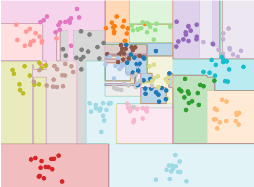
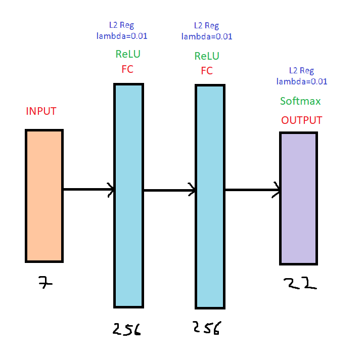
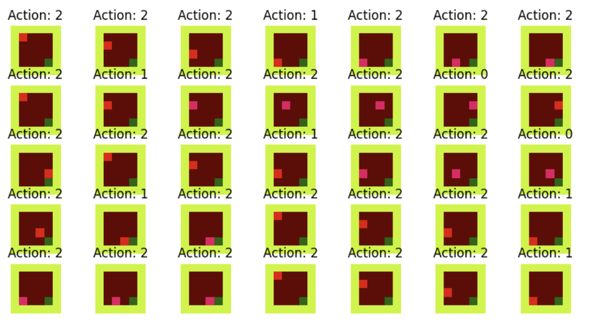
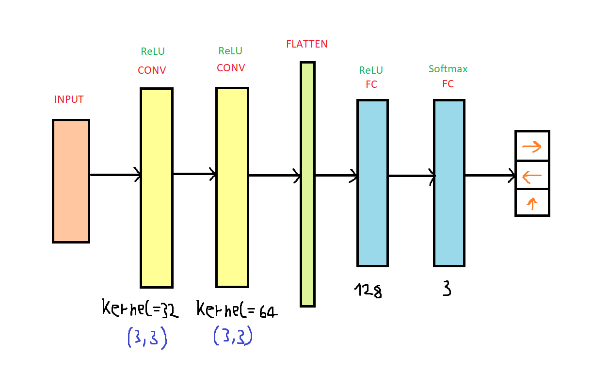
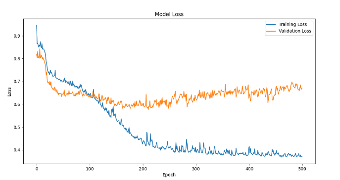

# MachineLearning-2

## Table of Contents

- [Overview](#overview)
- [Decision Tree](#decision-tree)
- [Neural Network](#neural-network)
- [Behavioral Cloning](#behavioral-cloning)
- [Dependencies](#dependencies)

## Overview
There are solutions to machine learning problems assigned as part of a college project. This project has three main tasks: Decision Trees, Neural Networks, and Behavioral Cloning.

## Decision Tree
The dataset ```crop.csv```, includes various soil parameters. The goal is to train a decision tree model to recommend seeds for planting based on the soil data. <br>

Using the dataset, we train a classifier to predict the most suitable seeds based on soil characteristics. The decision tree model's visualization below shows how the data points are classified into different categories.

<p float="left">
  
</p>

## Neural Network
The same dataset, ```crop.csv```, is used to train a neural network model to recommend seeds. Neural network is manually implemented, defining layers and activation functions using matrix operations. <br>

Neural network architecture that is used in this problem is shown below.

<p float="left">
  
</p>

## Behavioral Cloning
In this task, we train a convolutional neural network using the Keras library to solve the MiniGrid-Empty-Random-6x6-v0 environment.

### Step 3a: Data Recording
First, we need to run ```record.py``` to create training data (we solve environment manually). Every command, along with the current state, will be recorded and we will get our dataset which looks like this:

<p float="left">
  
</p>

### Step 3b: Training the Model
After recording we have to run ```training.py``` to load the data from the previous step and train the model.

Neural network architecture that is used in this problem and training results are shown below.

<p float="left">


</p>

### Step 3c: Model Testing
Finally, ```test.py``` contains the code to test the trained model. A window will display how our model solves the environment, and the average reward over 10 consecutive tests will be shown.

## Dependencies
- pandas
- matplotlib
- numpy
- tensorflow
- keras
- gymnasium
- pygame
- minigrid
